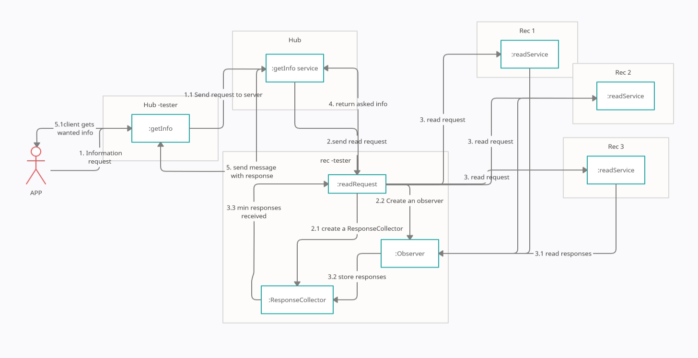

# Relatório do projeto *Bicloin*

Sistemas Distribuídos 2020-2021, segundo semestre.

## Autores

**Grupo T07**

| Número | Nome              | Utilizador                       | Correio eletrónico                  |
| -------|-------------------|----------------------------------| ------------------------------------|
| 78631 | Maria Sbrancia | <https://git.rnl.tecnico.ulisboa.pt/ist178631>   | <mailto:maria.sbrancia@tecnico.ulisboa.pt>   |
| 90732 | João Lopes       | <https://git.rnl.tecnico.ulisboa.pt/ist190732>     | <mailto:joao.m.gaspar.lopes@tecnico.ulisboa.pt>     |
| 93743  | Nelson Trindade     | <https://git.rnl.tecnico.ulisboa.pt/ist193743> | <mailto:nelson.trindade@tecnico.ulisboa.pt> |

  

## Melhorias da primeira parte

A primeira versão possuía um erro na demo, não era avisado que após a execução dos testes no hub era necessário relançar o servidor hub e como tal, a app não corria após a execução dos testes. Além de corrigirmos esse pormenor, foi melhorada a componente da concorrência. A primeira versão possuía um erro na demo, não era avisado que após a execução dos testes no hub era necessário relançar o servidor hub e como tal, a app não corria após a execução dos testes. Além de corrigirmos esse pormenor, foi melhorada a componente da concorrência. 

- [Tag da melhoria apresentada](https://git.rnl.tecnico.ulisboa.pt/SD-20-21-2/T07-Bicloin/src/tag/SD_P1_V2)

## Modelo de faltas

O seguinte projeto apresenta uma versão do protocolo de registo coerente. O sistema é assíncrono e só existirão réplicas no servidor rec, existindo apenas uma instância do servidor hub. 

 Seja `N` o total das réplicas existentes do servidor rec, e tendo que `N = 2f + 1`, o protocolo de registo coerente tolera no máximo `f` servidores. Isto implica que só poderão falhar `(N-1)/2` servidores, ou seja, uma minoria de gestores de rec em falha em simultâneo. Na implementação adotada, só é aceite um número de réplicas ímpar, de forma a simplificar o cálculo das faltas toleradas. 

Não são toleradas incoerências de informação. Os quorums Q representam no mínimo a maioria das réplicas existentes. Relembremos que tendo `N = 2f +1` , o tamanho de um dado quórum será `f + 1`. 

Não são toleradas faltas arbitrárias/bizantinas. Existem faltas silenciosas que são toleradas. O fecho da janela do terminal , a invocação do comando `Ctrl+C` ou `kill -9` , desencadeia um sinal `SIGKILL` que fechará os canais de todas as réplicas existentes. O processo pode ser colocado em pausa através de um `Ctrl+Z` ou do comando `kill -20` e a sua atividade poderá ser resolvida por meio do `fg` ou do comando `kill -18`.

A implementação permite um número de réplicas dinâmico, desde que o total das réplicas `N` seja um número ímpar. Os endereços não são conhecidos à priori e podem variar ao longo do tempo. 

## Protocolo de replicação

O protocolo de registo coerente com uso de quóruns garante que cada quórum de escrita tem pelo menos uma réplica em comum com cada quórum de leitura ou quórum de escrita. Isto é garantido, pois  o tamanho de um quórum para um dado sistema é sempre maior que a metade das réplicas existentes no mesmo . 

As tags dos registos são compostas por:

* seq - número de sequência da escrita que deu origem à versão. Incrementado a cada atualização do registo.

* cid - identificador do cliente que escreveu essa versão (assume-se que cada cliente tem um cid único). O cid do cliente corresponderá à instância que o cliente representa. 

Uma tag é maior que outra se seq1 > seq2 . Caso seq1 = seq2 , a maior tag será a que possua o maior cid. 

Na leitura:

Cliente:	

1. Envia read() para todas as réplicas
2. Aguarda por respostas de um quórum (ou seja, f+1 respostas) 
3. Seja maxVal o valor que recebeu associado à maior tag 
4. Retorna maxVal

Na escrita:

Cliente: 	
1. Executa leitura para obter a maior tag maxtag = <seq,cid>
2. Atualiza a versão da tag : newtag =  <seq +1, my_cid>
3. Envia write(val, newtag) a todas as réplicas 
4. Espera por respostas de um quórum (ou seja, f+1 respostas) 
5. Retorna ao cliente.

## Solução

O UML de colaboração apresentado, esquematiza as fases de invocação do sistema replicado. Numa primeira instância o cliente envia o pedido a um ou mais gestores de réplica. Os gestores de réplica coordenam-se de forma a executar o pedido coerentemente. De seguida, cada gestor de réplica executa o pedido. É chegado a um acordo por parte dos gestores de réplica sobre o efeito do pedido e, finalmente, um ou mais gestores respondem ao cliente. O exemplo demonstra o funcionamento de um pedido de leitura que a única diferença lógica que apresenta relativamente a um pedido de escrita, é na fase do acordo sobre o efeito do pedido. 

Uma vez que se trata de um sistema assíncrono o cliente não espera pelas respostas às suas chamadas, estas são verificadas mais tarde o que implica o uso de um stub não bloqueante. 

Para poder ser feito este tipo de chamada, é passado como argumento na chamada do cliente, um objeto de callback do tipo `StreamObserver`. No âmbito do projeto, trata-se de um objeto chamado `Observer` onde é feito o devido override dos métodos `onNext`, `onError` e `onCompleted`. No caso de uma resposta normal, onNext, a resposta é guardada num objeto nomeado `ResponseCollector`. O `ResponseCollector` possui também as respostas de erro encadeadas pela chamada ao método `onError`. A existência deste objeto facilita a verificação de que exista um mínimo de réplicas em falha e uma maioria de réplicas a responder. Os contadores de erro e de receção de resposta no `StreamObserver` são variáveis `volatile` de forma a garantir que todas as outras `Thread` que se encontram a correr sejam notificadas de alterações nos contadores. 

Adicionalmente, foi criada uma classe `RecThread` do tipo `Thread` que possui o método `waitNeededAcks` que espera até ter recebido o mínimo de respostas necessárias (tamanho do quórum) para prosseguir a execução e garantir a coerência da informação. Os métodos de `read` e de `write` inicialmente procuram com recurso ao zookeeper as réplicas de servidores rec existentes. De seguida, criam um `ResponseCollector` e o devido `Observer` associado ao mesmo. Por fim, criam uma thread do tipo `RecThread` que irá adquirir um trinco até não terem sido recebidas todas as respostas necessárias. Quando o objeto `RecThread` termina a sua espera é devolvida a “melhor” resposta, que será a que possui a tag mais recente. 
Uma vez que as réplicas no `QuorumFrontend` são sempre encontradas através do zookeeper garante-se que na eventualidade de mudança de endereços por parte dos servidores, estes são encontrados. 

O `RecFrontend` é apenas usado para a execução dos comandos de diagnóstico: `ping` e `sys_status`. A interação observada no UML de colaboração é coordenada pelo `QuorumFrontend`, que executa as escritas e as leituras nas diversas réplicas de acordo com o protocolo de registo coerente. 

Na solução apresentada, não foi necessário implementar a política de `write-back`. O `write-back` é necessário se o cliente executar uma sequência de leituras concorrentes com escritas, podendo obter resultados incoerentes. Uma vez que o Hub adquire um trinco para a execução de blocos que possuem leituras e escritas, não permitirá a realização de leituras e escritas não sequencias, evitando assim a implementação da política de `write-back`.

## Medições de desempenho

_(Tabela-resumo)_

_(explicação)_

## Opções de implementação

Decidimos implementar a versão completa do protocolo de registo coerente sem uso da política write-back. De forma a encapsular lógicas diferentes no que diz respeito aos pedidos realizados nas réplicas do rec, existem dois front-ends para o mesmo. O RecFrontend efetua os pedidos de diagnóstico do sistema `ping` e `sys_status`. O `QuorumFrontend` é onde se encontra implementado o protocolo para as leituras e as escritas. 

 Não nos foi possível efetuar optimizações, pelo que não serão apresentados dados comparativos entre versões. Se tivéssemos chegado a esta instância teríamos experiementado a variante ao protocolo com pesos variáveis, que permite dar mais peso a réplicas com alguma característica desejável. Uma vez que são efetuadas mais leituras que escritas, teríamos testado o impacto de atribuir mais peso a quóruns de leitura. 

## Notas finais

_(Algo mais a dizer?)_
